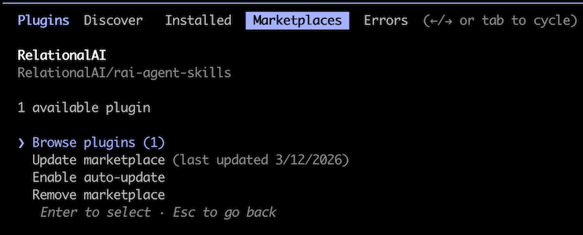
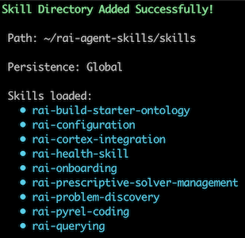

# RelationalAI Agent Skills

Empower your coding agent with the decision intelligence capabilities of [RelationalAI](https://relational.ai).

Skills are markdown files encoding **expert knowledge** – heuristics, workflows, and patterns – distributed as folders
and installed into a location the agent can discover (e.g. `~/.claude/skills/`). At runtime, the agent reads relevant
skills to inform its reasoning, and calls tools and APIs to take action.

```
          +---------+
          |  Agent  |
          +---------+
         /           \
     reads           calls
      /                 \
+-------------+   +-------------+
|   Skills    |   | Tools/APIs  |
| <knowledge> |   |  <actions>  |
+-------------+   +-------------+
```

The skills in this repo instruct your agent **how to use the `relationalai` Python package to leverage RelationalAI
ontologies and advanced reasoners by generating and executing PyRel code**. They roughly map to workflow steps.

- Generating PyRel enables the agent to create the RelationalAI ontology, extend it with reasoners, and use its outputs.
- By executing PyRel, the agent can then query the ontology to answer questions, resolve issues, or help with setup.

## Quickstart

**Easiest:** point your coding agent at this repo and paste the prompt below.

```
Install the RelationalAI Agent Skills (https://github.com/RelationalAI/rai-agent-skills) for your current environment. Provide me with instructions on how to keep up-to-date and leverage them across projects. Once installed, print the skill inventory given in the README.
```

**Most robust:** leverage an official channel that supports updates. The table below is for installing the skills on
your own machine — if you're rolling these out to a team, see [Distribute to a team](#distribute-to-a-team) below.

**Most flexible:** clone the repo and symlink its skills into your agent's skills directory. Local edits and
`git pull` updates propagate instantly across every linked agent. See **Install from source** under
[Detailed install guides](#detailed-install-guides) below.

### Install for yourself

| Agent                           | Install                                                                                                                             | Updates                                             |
|---------------------------------|-------------------------------------------------------------------------------------------------------------------------------------|-----------------------------------------------------|
| **Any 45+ agents** (Vercel CLI) | `npx skills add RelationalAI/rai-agent-skills --skill '*'`                                                                          | `npx skills update`                                 |
| **Claude Code** (CLI)           | `/plugin marketplace add RelationalAI/rai-agent-skills`<br>`/plugin install rai@RelationalAI`                                       | **Auto** — enable **Sync automatically**            |
| **Claude** (Desktop)            | Use the Customize → Personal plugins **+** UI flow. See the Detailed Install Guide                                                  | **Auto** — enable **Sync automatically**            |
| **Cortex Code** (CLI)           | `cortex skill add RelationalAI/rai-agent-skills/plugins/rai/skills`                                                                 | `cortex skill update RelationalAI/rai-agent-skills` |
| **Cortex Code** (Web)           | Clone/download the repo, open a workspace in Snowsight, then click **+** in CoCo → Upload Skills Directory -> `plugins/rai/skills/` | Re-upload the `plugins/rai/skills/` folder          |
| **Codex** (CLI)                 | `codex plugin marketplace add RelationalAI/rai-agent-skills`<br>Then inside a `codex` session: `/plugins` → install **rai**          | `codex plugin marketplace upgrade relationalai`     |
| **VS Code / Copilot**           | Add `"RelationalAI/rai-agent-skills"` to `chat.plugins.marketplaces`, then install **rai** from Extensions (`@agentPlugins`)         | **Auto** (every 24h)                                |
| **Cursor**                      | No personal marketplace import yet — use **Remote Rules** as a fallback. See the [Cursor guide](#cursor) below                      | Manual re-import                                    |

After installing, start a new session for the skills to become available.

### Distribute to a team

For channels with documented admin paths. Rows here complement — not replace — the individual install above.

| Channel                              | Setup                                                                                                                                                  | Rollout                                                                             |
|--------------------------------------|--------------------------------------------------------------------------------------------------------------------------------------------------------|-------------------------------------------------------------------------------------|
| **Claude Code** (project settings)   | Commit `extraKnownMarketplaces` to `.claude/settings.json` so the marketplace travels with your repo                                                   | Teammates are prompted to add the marketplace and install **rai** on folder trust  |
| **Claude Code** (managed / enforced) | Deploy `enabledPlugins` (force-enable) and/or `strictKnownMarketplaces` (allowlist) in OS-level `managed-settings.json`                                | Plugins force-enabled org-wide; users cannot disable                               |
| **Cursor** (Teams/Enterprise)        | Dashboard → Settings → Plugins → Team Marketplaces → **Import**, paste this repo's URL                                                                 | Teammates see **rai** in their Plugins panel; re-import from dashboard to update    |
| **VS Code / Copilot** (workspace)    | Commit `extraKnownMarketplaces` (and optionally `enabledPlugins`) to `.github/copilot/settings.json` — or reuse `.claude/settings.json` above to cover both channels | VS Code surfaces a notification on first chat message; teammates browse via `@agentPlugins @recommended` in Extensions |

## What's included

Invoke the skills using the `/rai-` command.

| #  | Skill                                                                                                                                                | Area        | Description                                                                       |
|:---|:-----------------------------------------------------------------------------------------------------------------------------------------------------|:------------|:----------------------------------------------------------------------------------|
| 1  | [rai-onboarding](https://github.com/RelationalAI/rai-agent-skills/tree/main/skills/rai-onboarding)                                                   | Setup       | First-time setup — install, connect to Snowflake, validate                        |
| 2  | [rai-configuration](https://github.com/RelationalAI/rai-agent-skills/tree/main/skills/rai-configuration)                                             | Setup       | Config files, connections, authentication, model and engine settings              |
| 3  | [rai-pyrel-coding](https://github.com/RelationalAI/rai-agent-skills/tree/main/skills/rai-pyrel-coding)                                               | Development | Language syntax — imports, types, concepts, properties, data loading              |
| 4  | [rai-build-starter-ontology](https://github.com/RelationalAI/rai-agent-skills/tree/main/skills/rai-build-starter-ontology)                           | Ontology    | Build a first ontology from Snowflake tables or local data                        |
| 5  | [rai-ontology-design](https://github.com/RelationalAI/rai-agent-skills/tree/main/skills/rai-ontology-design)                                         | Ontology    | Domain modeling — concepts, relationships, data mapping, enrichment               |
| 6  | [rai-rules-authoring](https://github.com/RelationalAI/rai-agent-skills/tree/main/skills/rai-rules-authoring)                                         | Ontology    | Business rules as PyRel derived properties — validation, classification, alerting |
| 7  | [rai-querying](https://github.com/RelationalAI/rai-agent-skills/tree/main/skills/rai-querying)                                                       | Reasoning   | Query construction — aggregation, filtering, joins, ordering, export              |
| 8  | [rai-discovery](https://github.com/RelationalAI/rai-agent-skills/tree/main/skills/rai-discovery)                                                     | Reasoning   | Surface answerable questions, classify by reasoner type, route to workflow        |
| 9  | [rai-graph-analysis](https://github.com/RelationalAI/rai-agent-skills/tree/main/skills/rai-graph-analysis)                                           | Reasoning   | Graph algorithms — centrality, community detection, reachability, similarity      |
| 10 | [rai-prescriptive-problem-formulation](https://github.com/RelationalAI/rai-agent-skills/tree/main/skills/rai-prescriptive-problem-formulation)       | Reasoning   | Formulate optimization — decision variables, constraints, objectives              |
| 11 | [rai-prescriptive-solver-management](https://github.com/RelationalAI/rai-agent-skills/tree/main/skills/rai-prescriptive-solver-management)           | Reasoning   | Solver lifecycle — selection, creation, execution, diagnostics                    |
| 12 | [rai-prescriptive-results-interpretation](https://github.com/RelationalAI/rai-agent-skills/tree/main/skills/rai-prescriptive-results-interpretation) | Reasoning   | Post-solve — solution extraction, status codes, quality, sensitivity              |
| 13 | [rai-cortex-integration](https://github.com/RelationalAI/rai-agent-skills/tree/main/skills/rai-cortex-integration)                                   | Operations  | Deploy RAI models as Snowflake Cortex Agents                                      |
| 14 | [rai-health-skill](https://github.com/RelationalAI/rai-agent-skills/tree/main/skills/rai-health-skill)                                               | Operations  | Diagnose engine performance — memory, CPU, demand metrics, remediation            |

## Prerequisites

**Requires `relationalai` (PyRel) v1.0.14+**

The RelationalAI Native App for Snowflake must be installed in your account by an administrator.

- Request access [here](https://app.snowflake.com/marketplace/listing/GZTYZOOIX8H/relationalai-relationalai).
- See the [RAI Native App docs](https://docs.relational.ai/manage/install) for details.

The `rai_developer` role is needed to execute PyRel programs.

## Detailed install guides

<details>
<summary><b>Claude Code CLI</b></summary>

Follow [these instructions](https://code.claude.com/docs/en/discover-plugins#add-marketplaces) to point at this repo.
See this quick [video](https://www.loom.com/share/a78519cfa60149158779cb9925a44a1b) for an overview.

```
/plugin marketplace add RelationalAI/rai-agent-skills
/plugin install rai@RelationalAI
# or use the wizard
/plugin
```

Restart your session after installing. To keep the plugin current, open the **Plugins** directory, click the **···**
menu on the **rai-agent-skills** tile, and enable **Sync automatically** — it pulls new commits from the default
branch without a manual step. Use **Check for updates** from the same menu for an on-demand refresh.



</details>

<details>
<summary><b>Claude Desktop</b></summary>

1. Click **Customize** in the left sidebar.
2. Next to **Personal plugins**, click the **+** button, then select **Create plugin** → **Add marketplace**.
3. In the **Add marketplace** dialog, enter `RelationalAI/rai-agent-skills` and click **Sync**.
4. Click **+** next to **Personal plugins** again, then select **Browse plugins**.
5. Open the **Personal** tab, find the **Rai** tile, and click **+** to install it.
6. **Recommended:** on the **rai-agent-skills** plugin tile, open the **···** menu and toggle **Sync automatically** on.
   New commits on the default branch will be pulled in without a manual update step.

Alternatively, download this repo's contents and copy the skills into the Claude app.

</details>

<details>
<summary><b>VS Code / GitHub Copilot</b></summary>

Follow [these instructions](https://code.visualstudio.com/docs/copilot/customization/agent-plugins#_configure-plugin-marketplaces)
to register this repo as a plugin marketplace.

```json
// settings.json
"chat.plugins.marketplaces": [
"RelationalAI/rai-agent-skills"
]
```

Then open the Extensions view (⇧⌘X), search `@agentPlugins`, and install **Rai**. Updates install automatically (every
24h by default when `extensions.autoUpdate` is on).

</details>

<details>
<summary><b>Cortex Code CLI</b></summary>

```bash
cortex skill add RelationalAI/rai-agent-skills/skills
```

Point Cortex at the `/skills` subdirectory (not the repo root) — Cortex's auto-discovery expects skills at a
conventional layout and will reject the repo root otherwise. Later, run
`cortex skill update RelationalAI/rai-agent-skills` to pull new versions.

Or follow [the docs](https://docs.snowflake.com/en/user-guide/cortex-code/extensibility#skills) to clone the repo
locally and use the `/skill` dialog to add the [skills](skills) folder.



</details>

<details>
<summary><b>Cortex Code (Web)</b></summary>

Cortex Code in the Snowflake web UI doesn't pull directly from GitHub — you load skills from a local folder.

1. Clone the repo or [download the ZIP](https://github.com/RelationalAI/rai-agent-skills/archive/refs/heads/main.zip)
   and unzip it.
2. In Snowsight, open a workspace and launch **Cortex Code** from the left sidebar.
3. In the Cortex Code panel, click the **+** button and choose **Upload Skill Folder(s)**.
4. Select the repo's `skills/` folder (not the repo root).

To update, pull the latest changes locally (or re-download the ZIP) and upload the `skills/` folder again.

</details>

<details>
<summary><b>OpenAI Codex (CLI)</b></summary>

This repo ships a Codex plugin marketplace manifest at `.agents/plugins/marketplace.json`, so you can add it directly
by GitHub shorthand:

```bash
codex plugin marketplace add RelationalAI/rai-agent-skills
```

Then start a Codex session and open the plugin browser:

```bash
codex
```

Inside the session, run the `/plugins` slash command, switch to the **relationalai** marketplace tab, and install
**rai**. Restart the session for skills to become available.

To pull new releases later:

```bash
codex plugin marketplace upgrade relationalai
```

See [the Codex plugins docs](https://developers.openai.com/codex/plugins) for more on the marketplace flow.

</details>

<details>
<summary><b>Cursor</b></summary>

This repo ships a Cursor marketplace manifest at `.cursor-plugin/marketplace.json`. How you install depends on your
plan.

**Teams / Enterprise admins.** Cursor supports importing a third-party plugin marketplace from a GitHub repo:

1. Open **Dashboard → Settings → Plugins**.
2. Under **Team Marketplaces**, click **Import** and paste
   `https://github.com/RelationalAI/rai-agent-skills`.
3. Review the parsed plugins, assign **Team Access** groups, name the marketplace, and save.

Teammates then see **rai** in their Plugins panel and install it with one click. To pull new releases, re-import from
the dashboard. Teams plans support up to 1 team marketplace; Enterprise supports unlimited.

**Individual users.** Cursor does not currently expose a personal marketplace-import UI, so plugin-level install isn't
available yet on free/Pro plans. As a fallback, use **Remote Rules** to get the skill content (without the plugin
wiring):

1. Follow [these instructions](https://cursor.com/docs/skills#installing-skills-from-github).
2. Paste `https://github.com/RelationalAI/rai-agent-skills.git` as a Remote Rule (GitHub).

Remote Rules do not auto-sync — re-import from GitHub (or `git pull` if you cloned into `.cursor/rules/`) to pick up
updates.

</details>

<details>
<summary><b>Any coding agent (Vercel <code>skills</code> CLI)</b></summary>

[Vercel's skills CLI](https://github.com/vercel-labs/skills) (requires `npm` v5.2.0+) manages skills across 45+ agents
including Claude Code, Cursor, Codex, Copilot, Windsurf, Cline, Continue, Gemini CLI, Warp, and more.

```bash
# install all skills to all detected agents
npx skills add RelationalAI/rai-agent-skills --skill '*'

# scope to a specific agent
npx skills add RelationalAI/rai-agent-skills --skill '*' --agent cortex

# later: pull updates
npx skills update
```

</details>

<details>
<summary><b>Install from source (clone + symlink)</b></summary>

For power users and contributors: clone once and symlink each skill into every agent you use. Local edits and
upstream `git pull`s both propagate instantly — no re-import step.

```bash
git clone https://github.com/RelationalAI/rai-agent-skills.git ~/src/rai-agent-skills
cd ~/src/rai-agent-skills

# link each skill into the agent's skills directory (Claude Code shown):
for d in plugins/rai/skills/*/; do
  ln -s "$PWD/$d" ~/.claude/skills/$(basename "$d")
done
```

Swap the target directory for other agents: `~/.agents/skills/` (Codex), `~/.cursor/rules/` (Cursor — as Remote
Rules). To expose the plugin as a unit rather than loose skills, symlink the whole `plugins/rai/` directory into
the agent's local-plugins location (e.g., `~/.cursor/plugins/local/rai`). Run `git pull` inside the clone to update.

</details>
