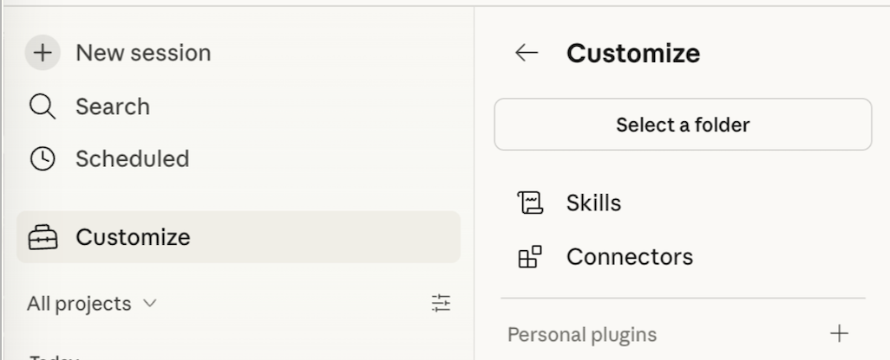

# RelationalAI Agent Skills

Empower your coding agent with the decision intelligence capabilities of [RelationalAI](https://relational.ai).

Skills are markdown files encoding expert knowledge — heuristics, workflows, and patterns. They are distributed as folders and installed into a location the agent can discover (e.g. ~/.claude/skills/). At runtime, the agent reads relevant skills to inform its reasoning, and calls tools to take action. Skills shape how the agent thinks; tools shape what it can do.

```
          +---------+
          |  Agent  |
          +---------+
         /           \
     reads           calls
      /                 \
+-------------+   +-------------+
|   Skills    |   |    Tools    |
| <knowledge> |   |  <actions>  |
+-------------+   +-------------+
```

The skills in this repo instruct your agent how to use the `relationalai` Python package (aka PyRel) to leverage RAI semantic models and advanced reasoners.

## Prerequisites
**Assumes `relationalai` (PyRel) v1.0.12+**

The RelationalAI Native App for Snowflake must be installed in your account by an administrator.
- Request access [here](https://app.snowflake.com/marketplace/listing/GZTYZOOIX8H/relationalai-relationalai). 
- See the [RAI Native App docs](https://docs.relational.ai/manage/install) for details.

The `rai_developer` role is needed to execute PyRel programs.

## Installation

### Generic

- You or your agent can manually copy the contents of our [skills](skills) folder into your skills folder.

- [Vercel's skills CLI](https://github.com/vercel-labs/skills) (requres `npm` v5.2.0+) helps you manage & update skills for most coding agents.
```bash
npx skills add RelationalAI/rai-agent-skills --skill '*'
# optionally specify an agent
npx skills add RelationalAI/rai-agent-skills --skill '*' --agent cortex
```

### Claude Code
Follow [these instructions](https://code.claude.com/docs/en/discover-plugins#add-marketplaces) to point at this repo.

Also see this quick [video](https://www.loom.com/share/a78519cfa60149158779cb9925a44a1b) for an overview.

Example:
```
/plugin marketplace add RelationalAI/rai-agent-skills
/plugin install rai@RelationalAI
# or use the wizard
/plugin
```
Restart your session after installing.


### Claude Desktop
1. Open the Claude Desktop app and go to **Customize** in the left sidebar.
2. Under **Plugins**, browse the directory and find **Rai** by RelationalAI.
3. Click to install, then toggle the plugin on.

Skills will be available in your next session.




### Cortex Code
Follow [these instructions](https://docs.snowflake.com/en/user-guide/cortex-code/extensibility#skills).

In short, clone this repo to your file system then use the `/skill` dialog to add the [skills](skills) folder.


### VSCode
Follow [these instructions](https://code.visualstudio.com/docs/copilot/customization/agent-plugins#_configure-plugin-marketplaces) to point at this repo.

Example:
```
// settings.json
"chat.plugins.marketplaces": [
    "RelationalAI/rai-agent-skills"
]
```
