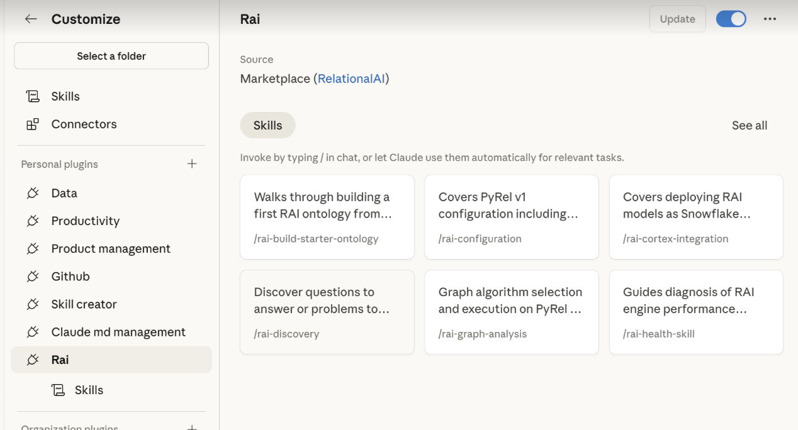

# RelationalAI Agent Skills

Empower your coding agent with the decision intelligence capabilities of [RelationalAI](https://relational.ai).

Skills are markdown files encoding **expert knowledge** – heuristics, workflows, and patterns – distributed as folders and installed into a location the agent can discover (e.g. `~/.claude/skills/`). At runtime, the agent reads relevant skills to inform its reasoning, and calls tools and APIs to take action. 

```
          +---------+
          |  Agent  |
          +---------+
         /           \
     reads           calls
      /                 \
+-------------+   +-------------+
|   Skills    |   | Tools/APIs  |
| <knowledge> |   |  <actions>  |
+-------------+   +-------------+
```

The skills in this repo instruct your agent **how to use the `relationalai` Python package to leverage RelationalAI ontologies and advanced reasoners by generating and executing PyRel code**. They roughly map to workflow steps.
- Generating PyRel enables the agent to create the RelationalAI ontology, extend it with reasoners, and use its outputs. 
- By executing PyRel, the agent can then query the ontology to answer questions, resolve issues, or help with setup.

## Usage
**Invoke the skills using the `/rai-` command.**

| # | Skill | Area | Description |
|:--|:------|:-----|:---------------------------------------------------------------------|
| 1 | [rai-onboarding](https://github.com/RelationalAI/rai-agent-skills/tree/main/skills/rai-onboarding) | Setup | First-time setup — install, connect to Snowflake, validate |
| 2 | [rai-configuration](https://github.com/RelationalAI/rai-agent-skills/tree/main/skills/rai-configuration) | Setup | Config files, connections, authentication, model and engine settings |
| 3 | [rai-pyrel-coding](https://github.com/RelationalAI/rai-agent-skills/tree/main/skills/rai-pyrel-coding) | Development | Language syntax — imports, types, concepts, properties, data loading |
| 4 | [rai-build-starter-ontology](https://github.com/RelationalAI/rai-agent-skills/tree/main/skills/rai-build-starter-ontology) | Ontology | Build a first ontology from Snowflake tables or local data |
| 5 | [rai-ontology-design](https://github.com/RelationalAI/rai-agent-skills/tree/main/skills/rai-ontology-design) | Ontology | Domain modeling — concepts, relationships, data mapping, enrichment |
| 6 | [rai-rules-authoring](https://github.com/RelationalAI/rai-agent-skills/tree/main/skills/rai-rules-authoring) | Ontology | Business rules as PyRel derived properties — validation, classification, alerting |
| 7 | [rai-querying](https://github.com/RelationalAI/rai-agent-skills/tree/main/skills/rai-querying) | Reasoning | Query construction — aggregation, filtering, joins, ordering, export |
| 8 | [rai-discovery](https://github.com/RelationalAI/rai-agent-skills/tree/main/skills/rai-discovery) | Reasoning | Surface answerable questions, classify by reasoner type, route to workflow |
| 9 | [rai-graph-analysis](https://github.com/RelationalAI/rai-agent-skills/tree/main/skills/rai-graph-analysis) | Reasoning | Graph algorithms — centrality, community detection, reachability, similarity |
| 10 | [rai-prescriptive-problem-formulation](https://github.com/RelationalAI/rai-agent-skills/tree/main/skills/rai-prescriptive-problem-formulation) | Reasoning | Formulate optimization — decision variables, constraints, objectives |
| 11 | [rai-prescriptive-solver-management](https://github.com/RelationalAI/rai-agent-skills/tree/main/skills/rai-prescriptive-solver-management) | Reasoning | Solver lifecycle — selection, creation, execution, diagnostics |
| 12 | [rai-prescriptive-results-interpretation](https://github.com/RelationalAI/rai-agent-skills/tree/main/skills/rai-prescriptive-results-interpretation) | Reasoning | Post-solve — solution extraction, status codes, quality, sensitivity |
| 13 | [rai-cortex-integration](https://github.com/RelationalAI/rai-agent-skills/tree/main/skills/rai-cortex-integration) | Operations | Deploy RAI models as Snowflake Cortex Agents |
| 14 | [rai-health-skill](https://github.com/RelationalAI/rai-agent-skills/tree/main/skills/rai-health-skill) | Operations | Diagnose engine performance — memory, CPU, demand metrics, remediation |

## Prerequisites
**Requires `relationalai` (PyRel) v1.0.14+** — the model-introspection API (`relationalai.semantics.inspect`) and queryable prescriptive Concept subtypes (`ProblemVariable`, `ProblemConstraint`, `ProblemObjective`) documented in these skills are only available in 1.0.14 and later.

The RelationalAI Native App for Snowflake must be installed in your account by an administrator.
- Request access [here](https://app.snowflake.com/marketplace/listing/GZTYZOOIX8H/relationalai-relationalai). 
- See the [RAI Native App docs](https://docs.relational.ai/manage/install) for details.

The `rai_developer` role is needed to execute PyRel programs.

## Installation
Note: For most coding agents, the installed skills will be available in your next session.

### Any Coding Agent
- Ask your agent to copy the contents of this repo's [skills](skills) folder into its skills folder.
- [Vercel's skills CLI](https://github.com/vercel-labs/skills) (requires `npm` v5.2.0+) helps you manage & update skills for most coding agents.
```bash
npx skills add RelationalAI/rai-agent-skills --skill '*'
# optionally specify an agent
npx skills add RelationalAI/rai-agent-skills --skill '*' --agent cortex
```

### Claude Code CLI
Follow [these instructions](https://code.claude.com/docs/en/discover-plugins#add-marketplaces) to point at this repo.

Also see this quick [video](https://www.loom.com/share/a78519cfa60149158779cb9925a44a1b) for an overview.

Example:
```
/plugin marketplace add RelationalAI/rai-agent-skills
/plugin install rai@RelationalAI
# or use the wizard
/plugin
```
Restart your session after installing.


### Cortex Code CLI
Follow [these instructions](https://docs.snowflake.com/en/user-guide/cortex-code/extensibility#skills).

In short, clone this repo to your file system then use the `/skill` dialog to add the [skills](skills) folder.


### VSCode
Follow [these instructions](https://code.visualstudio.com/docs/copilot/customization/agent-plugins#_configure-plugin-marketplaces) to point at this repo.

Example:
```
// settings.json
"chat.plugins.marketplaces": [
    "RelationalAI/rai-agent-skills"
]
```

### Cursor
Follow [these instructions](https://cursor.com/docs/skills#installing-skills-from-github).

In short, specify this repo's URL `https://github.com/RelationalAI/rai-agent-skills.git` as a Remote Rule (Github).

### OpenAI Codex
Follow [these instructions](https://developers.openai.com/codex/skills).

In short, download this repo's contents and ask your agent to copy the skills repo contents to the .agents/skills in your working repo root directory

### Claude Code Desktop App
1. Open the Claude Desktop app and go to **Customize** in the left sidebar.
2. Under **Plugins**, browse the directory and find **Rai** by RelationalAI.
3. Click to install, then toggle the plugin on.

Alternatively, you can download this repo's contents and copy the skills into the Claude app.


